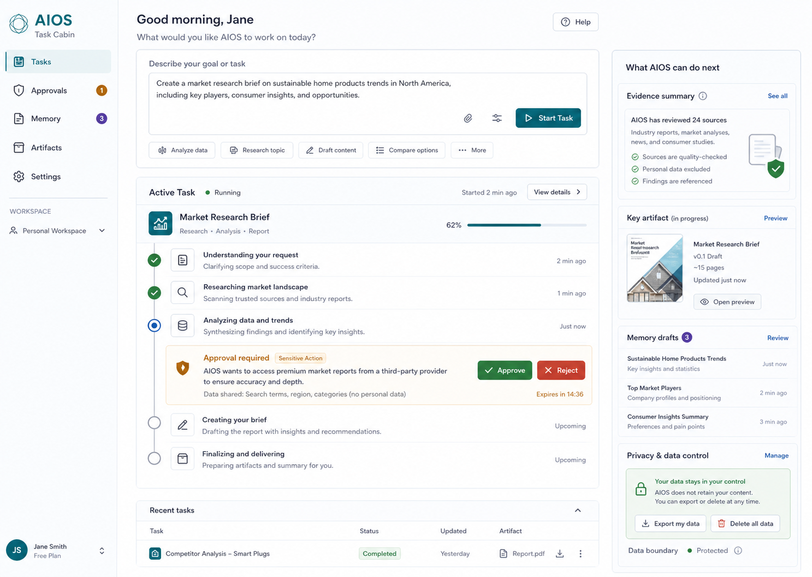
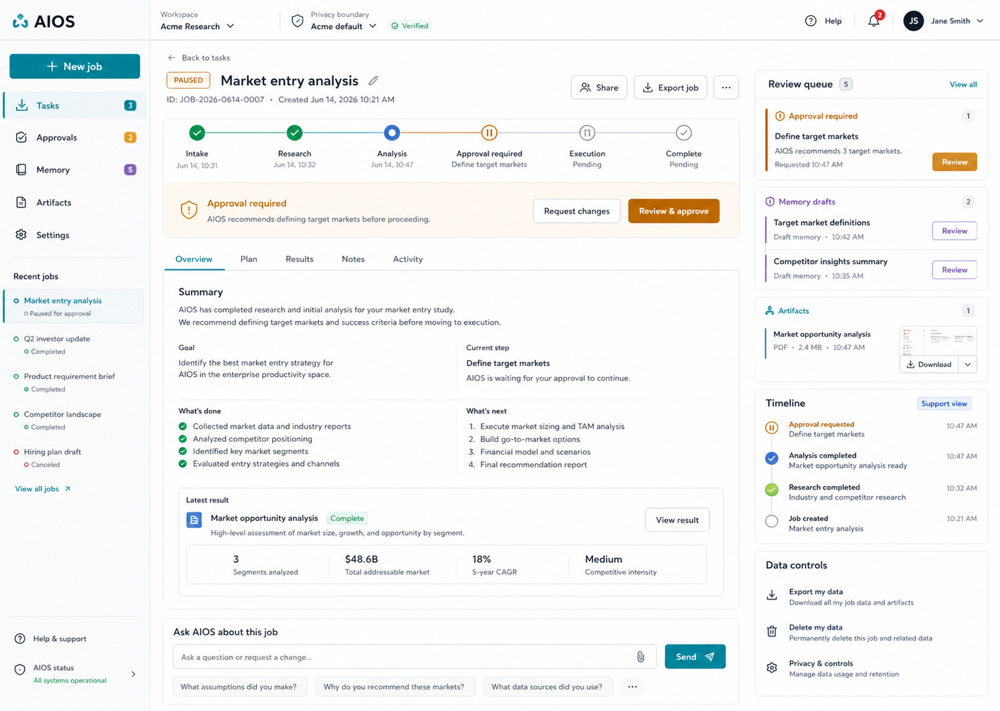
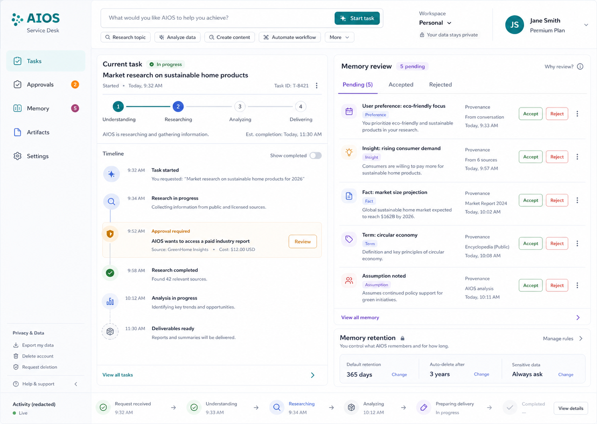

# AIOS Serving Design Brief

**Status**: awaiting visual target selection  
**Contract**: ASC-0268  
**Date**: 2026-06-14  

This brief records the Product Design ideation result for the real end-user
AIOS serving product. It is not permission to build `apps/serving/**`.

## Confirmed Product Brief

AIOS serving is a real user-facing agent-service product. Users should be able
to:

- submit goals or tasks to AIOS;
- track a resumable job timeline;
- approve or reject sensitive actions before execution continues;
- review MemoryOS drafts before acceptance;
- receive and download artifacts;
- export, delete, and control their own data;
- get support-safe timelines without exposing raw provider logs, raw contract
  bodies, operator-only state, or other users' data.

## Interactivity Target

The selected prototype should be fully interactive for the first workflow:

- new task submission;
- job progress timeline;
- approval gate;
- memory draft review;
- artifact review/download;
- data export/delete controls represented in the UI.

## Visual Context Used

Product Design user-context preflight found no saved external design context.
Local AIOS context was inspected instead:

- `docs/product/AIOS_END_USER_SERVING_INTERFACE_SPEC.md`
- `docs/product/AIOS_SERVING_INTERFACE_ROUTE_MAP.md`
- `docs/contracts/ASC-0260-real-user-serving-release-spine.md`
- `docs/design/AIOS_CONTROL_CENTER_REFERENCE_BOARD.md`
- `.aios/screenshots/aios-control-center-reference-board-v4.png`
- `.aios/screenshots/aios-control-center-redesign-desktop-final.png`
- `.aios/screenshots/aios-chat-evidence-desk-after.png`
- `apps/control/styles.css`

The serving surface must not reuse the operator Control Center as the user
product. It may borrow only the AIOS semantic color language, density, evidence
discipline, and route/provenance clarity.

## Generated Options

### Option 1: Task Cabin

Focus: friendly task-first workspace with a clear composer, active timeline,
inline approval gate, right-side evidence summary, artifacts, memory drafts,
and privacy/data controls.

Best when: the first user experience should feel like "tell AIOS what to do,
then stay in control."

### Option 2: Mission Control For One Job

Focus: one-job execution canvas with stage map, paused approval state, review
queue, redacted timeline, artifacts, and data controls.

Best when: the product should make resumability, approvals, and job state the
main trust mechanism.

### Option 3: Memory-First Service Desk

Focus: job progress beside a prominent memory review panel, with accept/reject
controls, provenance, retention controls, and redacted activity.

Best when: the product should differentiate AIOS around user-owned memory,
review lifecycle, and privacy.

## Current Decision State

No option has been selected yet. The design gate must remain build-blocked
until the operator chooses one option or asks for a revised option.

Recommended next step:

1. Operator selects option `1`, `2`, or `3`, or asks for a revised hybrid.
2. Update `.aios/serving/design_gate.json` to a concrete visual target.
3. Only then accept/build the `apps/serving/**` prototype contract.

## Stop Conditions

- `ui_implementation_before_visual_target`
- `serving_ui_reuses_operator_control_center`
- `session_boundary_ambiguous`
- `approval_path_missing`
- `user_memory_not_visible`
- `privacy_boundary_ambiguous`
- `world_readiness_claim_without_browser_proof`
